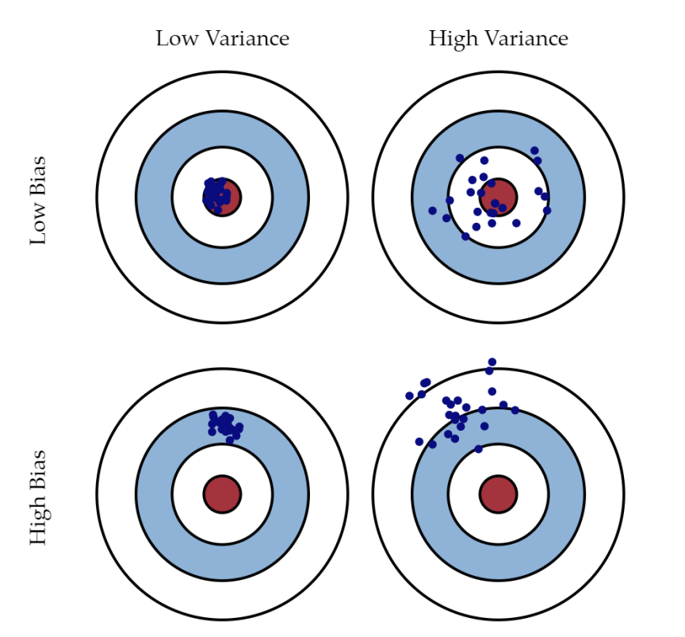
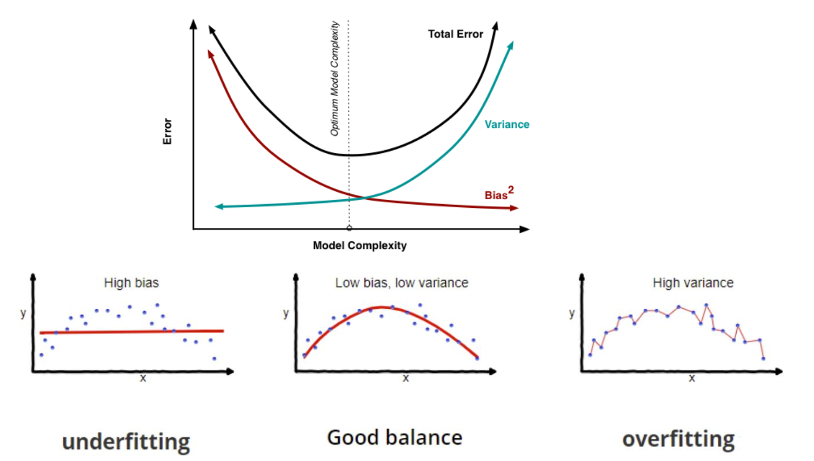

# Linear Regression

## Maximum likelihood estimation approach
For a single case with data $\mathbf{x} \in \mathbb{R}^{D \times 1}$ and weights $\boldsymbol{\theta} \in \mathbb{R}^{D \times 1} $, we assume the likelihood follow the normal distribution.
$$
    p(y|\mathbf{x}, \boldsymbol{\theta}) = \mathcal{N}(y| \boldsymbol{\theta}^{\top} \mathbf{x}, \sigma^2) 
$$

which is equivalent to
$$
    y = \boldsymbol{\theta}^{\top} \mathbf{x} + \epsilon, \quad \epsilon \sim \mathcal{N}(0, \sigma^2)
$$

Given data $\mathbf{X} \in \mathbb{R}^{N \times D}$ and its labels $\mathbf{y} \in \mathbb{R}^{N \times 1}$, with the parameters $\boldsymbol{\theta} \in \mathbb{R}^{D \times 1} $, the likelihood is
$$
   p(\mathbf{y}|\mathbf{X}, \boldsymbol{\theta}) = \prod_{n=1}^N p(y_n|\mathbf{x}_n, \boldsymbol{\theta})
$$

We use maximum likelihood estimation (MLE) to compute the optimal $\boldsymbol{\theta}^* = \boldsymbol{\theta}_{ML}$,
$$
    \boldsymbol{\theta}_{\text{ML}} = \underset{{\boldsymbol{\theta}}}{\mathrm{argmax}} \left( p(\mathbf{y}|\mathbf{X}, \boldsymbol{\theta}) \right)
$$

First obtain the log-likelihood,
$$
\begin{aligned}
\ln p(\mathbf{Y}|\mathbf{X}, \boldsymbol{\theta}) &= \ln \prod_{n=1}^N p(y_n|\mathbf{x}_n, \boldsymbol{\theta}) \\
&= \sum_{n=1}^N \ln  p(y_n|\mathbf{x}_n, \boldsymbol{\theta}) \\
&= \sum_{n=1}^N \ln \left[ \frac{1}{\sigma \sqrt{2\pi}}\exp(-\frac{1}{2\sigma^2}(y-\boldsymbol{\theta}^{\top} \mathbf{x})^2) \right] \\
&= \sum_{n=1}^N \left[ -\frac{1}{2\sigma^2}(y-\boldsymbol{\theta}^{\top} \mathbf{x})^2 + \ln \left( \sigma \sqrt{2\pi} \right) \right] \\
&= \sum_{n=1}^N \left[ -\frac{1}{2\sigma^2}(y-\boldsymbol{\theta}^{\top} \mathbf{x})^2 + \text{constant}  \right]
\end{aligned}
$$

We are also define a loss which is simply the negative log-likelihood function without the constant term. Hence if we minimize the loss we are maximizing the likelihood function. 
$$
    \boldsymbol{\theta}_{\text{ML}} = \underset{{\boldsymbol{\theta}}}{\mathrm{argmax}} \left( p(\mathbf{y}|\mathbf{X}, \boldsymbol{\theta}) \right) =  \underset{{\boldsymbol{\theta}}}{\mathrm{argmin}} \left( -p(\mathbf{y}|\mathbf{X}, \boldsymbol{\theta}) \right) = \underset{{\boldsymbol{\theta}}}{\mathrm{argmin} L(\boldsymbol{\theta}) }
$$

So we have the definition of the loss function.
$$
\begin{split}
    L(\boldsymbol{\theta}) &= \frac{1}{2\sigma^2} \sum_{n=1}^N  (y-\boldsymbol{\theta}^{\top} \mathbf{x})^2  \\
    &= \frac{1}{2\sigma^2}  (\mathbf{y}-\mathbf{X} \boldsymbol{\theta})^{\top} (\mathbf{y}-\mathbf{X} \boldsymbol{\theta} )  \\
    &= \frac{1}{2\sigma^2}  \| \mathbf{y}-\mathbf{X} \boldsymbol{\theta}\|_2^2
\end{split}
$$
    
thus we compute the derivative of $L$ over $\boldsymbol{\theta}$ and set it to $\mathbf{0}$. 
$$
\begin{split}
    \frac{\partial L(\boldsymbol{\theta})}{\partial \boldsymbol{\theta}} &= \frac{1}{2\sigma^2} \frac{\partial (\mathbf{y}^{\top}\mathbf{y} - 2\mathbf{y}^{\top}\mathbf{X}\boldsymbol{\theta} + \boldsymbol{\theta}^{\top}\mathbf{X}^{\top} \mathbf{X} \boldsymbol{\theta}) }{\partial \boldsymbol{\theta}} \\
    &= \frac{1}{2\sigma^2} (-2\mathbf{y}^{\top}\mathbf{X} + 2\boldsymbol{\theta}^{\top}\mathbf{X}^{\top} \mathbf{X}) = \mathbf{0}
\end{split}
$$

then we get,
$$
\begin{split}
&\boldsymbol{\theta}_{\text{ML}}^{\top}\mathbf{X}^{\top} \mathbf{X} = \mathbf{y}^{\top}\mathbf{X} \\
&\boldsymbol{\theta}_{\text{ML}}^{\top} = \mathbf{y}^{\top}\mathbf{X} (\mathbf{X}^{\top} \mathbf{X})^{-1}
\end{split}
$$

Thus we have
$$
\begin{split}
\boldsymbol{\theta}_{\text{ML}} &= ((\mathbf{X}^{\top} \mathbf{X})^{-1})^{\top} \mathbf{X}^{\top} \mathbf{y}\\ 
&= ((\mathbf{X}^{\top} \mathbf{X})^{\top})^{-1} \mathbf{X}^{\top} \mathbf{y}\\
&= (\mathbf{X}^{\top} \mathbf{X})^{-1} \mathbf{X}^{\top} \mathbf{y} \quad(\mathbf{X}^{\top} \mathbf{X} \text{ is symmetric and positive semi-definite})\\
\end{split}
$$

## Maximum a Posterior (MAP) approach
According to Bayes rule, we have the posterior of parameter $\boldsymbol{\theta}$ as,

$$
p(\boldsymbol{\theta}| \mathbf{X}, \mathbf{y}) = \frac{p(\mathbf{\mathbf{y}}|{\mathbf{X}, \boldsymbol{\theta}}) p(\boldsymbol{\theta}) }{p(\mathbf{y}|{\mathbf{X}})} \propto p(\mathbf{\mathbf{y}}|{\mathbf{X}, \boldsymbol{\theta}}) p(\boldsymbol{\theta})
$$

we will drop the $p(\mathbf{y}|{X})$ term since we only care about $\boldsymbol{\theta}$. Take the $\log$ of posterior we have,
$$
\begin{aligned}
\ln p(\boldsymbol{\theta}| \mathbf{X}, \mathbf{y}) &= \ln \left(  \frac{p(\mathbf{\mathbf{y}}|{\mathbf{X}, \boldsymbol{\theta}}) p(\boldsymbol{\theta}) }{p(\mathbf{y}|{\mathbf{X}})}  \right) \\
&= \ln p(\mathbf{\mathbf{y}}|{\mathbf{X}, \boldsymbol{\theta}}) + \ln p(\boldsymbol{\theta}) - \ln(p(\mathbf{y}|{\mathbf{X}})) \\
&=  \ln p(\mathbf{\mathbf{y}}|{\mathbf{X}, \boldsymbol{\theta}}) + \ln p(\boldsymbol{\theta}) + \text{const}
\end{aligned}
$$

Thus to find the MAP estimation of $\boldsymbol{\theta}_{\text{MAP}}$, we have
$$
\begin{aligned}
    \boldsymbol{\theta}_{\text{MAP}} &\in \underset{{\boldsymbol{\theta}}}{\mathrm{argmax}} \left( \ln p(\mathbf{\mathbf{y}}|{\mathbf{X}, \boldsymbol{\theta}}) + \ln p(\boldsymbol{\theta}) \right) \\
    &\in \underset{{\boldsymbol{\theta}}}{\mathrm{argmin}} \left( - \ln p(\mathbf{\mathbf{y}}|{\mathbf{X}, \boldsymbol{\theta}}) - \ln p(\boldsymbol{\theta}) \right)
\end{aligned}
$$

We simply take the derivative of $\ln p(\boldsymbol{\theta}| \mathbf{X}, \mathbf{y})$ over $\boldsymbol{\theta}$ and set it to $0$. (this is equivalent to finding max of $\left( \ln p(\mathbf{\mathbf{y}}|{\mathbf{X}, \boldsymbol{\theta}}) + \ln p(\boldsymbol{\theta}) \right)$ or min of $\left( - \ln p(\mathbf{\mathbf{y}}|{\mathbf{X}, \boldsymbol{\theta}}) - \ln p(\boldsymbol{\theta}) \right)$. 

This gives us,
$$ - \frac{\partial \ln p(\boldsymbol{\theta}| \mathbf{X}, \mathbf{y})}{\partial \boldsymbol{\theta}} = 
- \frac{\partial \ln p(\mathbf{\mathbf{y}}|{\mathbf{X}, \boldsymbol{\theta}})}{\partial \boldsymbol{\theta}} - \frac{d \ln p(\boldsymbol{\theta})} {d \boldsymbol{\theta}}$$

remember in the previous section we have derived: (the derivative of the loss function defined in MLE should be the same as that of $(- \ln p(\mathbf{\mathbf{y}}|{\mathbf{X}, \boldsymbol{\theta}}) )$
$$\frac{\partial (- \ln p(\mathbf{\mathbf{y}}|{\mathbf{X}, \boldsymbol{\theta}}) )}{\partial \boldsymbol{\theta}} = \frac{1}{2\sigma^2} (-2\mathbf{y}^{\top}\mathbf{X} + 2\boldsymbol{\theta}^{\top}\mathbf{X}^{\top} \mathbf{X}) $$

Thus here we need to take care of $p(\boldsymbol{\theta})$. Assume a (conjugate)  multivariate-Gaussian prior for $\boldsymbol{\theta}$, hence
$$
\begin{aligned}
p(\boldsymbol{\theta}) &= \mathcal{N}(\mathbf{0}, b^2 \mathbf{I}) \\
&= (2\pi)^{-\frac{D}{2}} \det(b^2\mathbf{I})^{-\frac{1}{2}} \exp \left( -\frac{\boldsymbol{\theta}^{\top} (b^2 \mathbf{I))^{-1}} \boldsymbol{\theta}}{2} \right) \\
&= (2\pi)^{-\frac{D}{2}} \left( \prod_{n=1}^{D} b^2 \right) ^{-\frac{1}{2}} \exp  \left( -\frac{\boldsymbol{\theta}^{\top} \boldsymbol{\theta}}{2b^2} \right) \\
&= (2\pi b^2 )^{-\frac{D}{2}} \exp \left( -\frac{\boldsymbol{\theta}^{\top} \boldsymbol{\theta}}{2b^2} \right)
\end{aligned}
$$

where $\boldsymbol{\theta} \in \mathbb{R}^{D \times 1}$, then we have
$$
\begin{aligned}
\ln(p(\boldsymbol{\theta}))
&=  \ln \left( (2\pi b^2 )^{-\frac{D}{2}} \right) + \left( -\frac{\boldsymbol{\theta}^{\top} \boldsymbol{\theta}}{2b^2} \right) \\
& =  -\frac{\boldsymbol{\theta}^{\top}\boldsymbol{\theta}}{2b^2} + \text{const}
\end{aligned}
$$

and 
$$\frac{d \ln(p(\boldsymbol{\theta})}{d \boldsymbol{\theta}} = - \frac{\boldsymbol{\theta}^{\top}}{b^2}$$

together we have
$$-\frac{\partial \ln p(\boldsymbol{\theta}| \mathbf{X}, \mathbf{y})}{\partial \boldsymbol{\theta}} = \frac{1}{2\sigma^2} (-2\mathbf{y}^{\top}\mathbf{X} + 2\boldsymbol{\theta}^{\top}\mathbf{X}^{\top} \mathbf{X}) + \frac{\boldsymbol{\theta}^{\top}}{b^2} = 0 $$

which gives us
$$
\begin{aligned}
& -\frac{\mathbf{y}^{\top}\mathbf{X}}{\sigma^2} + \frac{\boldsymbol{\theta}^{\top}\mathbf{X}^{\top} \mathbf{X}}{\sigma^2} + \frac{\boldsymbol{\theta}^{\top}}{b^2} = 0 \\
& \frac{\boldsymbol{\theta}^{\top}}{b^2} + \frac{\boldsymbol{\theta}^{\top}\mathbf{X}^{\top} \mathbf{X}}{\sigma^2}   = \frac{\mathbf{y}^{\top}\mathbf{X}}{\sigma^2} \\
& \boldsymbol{\theta}^{\top}\mathbf{X}^{\top} \mathbf{X} + \frac{{\sigma^2}}{b^2} \boldsymbol{\theta}^{\top}  =  \mathbf{y}^{\top}\mathbf{X} \\
& \boldsymbol{\theta}^{\top} =  \mathbf{y}^{\top}\mathbf{X} \left(\mathbf{X}^{\top} \mathbf{X} + \frac{{\sigma^2}}{b^2} \mathbf{I} \right)^{-1} \\
& \boldsymbol{\theta} = \left(\mathbf{X}^{\top} \mathbf{X} + \frac{{\sigma^2}}{b^2} \mathbf{I} \right)^{-1} \mathbf{X}^{\top}\mathbf{y} 
\end{aligned}
$$

Notice here $\mathbf{X}^{\top} \mathbf{X}$ is symmetric and positive semi-definite. Thus $\mathbf{X}^{\top} \mathbf{X} + \frac{{\sigma^2}}{b^2} \mathbf{I}$ is also symmetric and positive semi-definite.

# Bias and Variance Trade-off
We have a dataset $\mathcal{D} = \{(\mathbf{x}_1, y_1), (\mathbf{x}_2, y_2), ..., (\mathbf{x}_M, y_M) \}$, where $\mathbf{x} \in \mathbb{R}^N$ is the input feature and $y \in \mathbb{R}$ the label of the feature. 

The label of $\mathbf{x}$ is corrupted with some Gaussian white noise, hence we have
$$y = f(\mathbf{x}) + \epsilon = \mathbb{E}_y[y|x] + \epsilon$$
where $f(\mathbf{x})$ is the true label of $\mathbf{x}$, and $\epsilon \in \mathcal{N} (0, \sigma^2)$

The prediction based on ONE dataset $\mathcal{D}$ with $\mathbf{x}$ as the input is
$$\hat{y} = h_{\mathcal{D}}(\mathbf{x})$$

Some notations, if we have some expression $X$:
$$
\mathbb{E}_{\mathcal{D}} [X] = \int_{\mathcal{D}} X P(\mathcal{D}) d\mathcal{D} 
$$
$$
\mathbb{E}_{\mathbf{x}, y} [X] = \int_{\mathbf{x}} \int_{y} X P(\mathbf{x}, y) d\mathbf{x} dy
$$
$$
\mathbb{E}_{\mathcal{D}} \left[ \mathbb{E}_{\mathbf{x}, y} [X]\right] = \mathbb{E}_{\mathcal{D},\mathbf{x}, y} [X] = \int_{\mathcal{D}} \int_{\mathbf{x}} \int_{y} X P(\mathbf{x}, y) d\mathbf{x} dy P(\mathcal{D}) d\mathcal{D} 
$$

First, consider MSE over entire datasets
$$
\begin{aligned}
\mathbb{E}_{\mathcal{D},\mathbf{x}, y} \left[ (y - h_{\mathcal{D}}(\mathbf{x}))^2 \right] 
&= \mathbb{E}_{\mathcal{D}, {\mathbf{x}, y}} \left[ (y - \mathbb{E}_{\mathcal{D}}h_{\mathcal{D}}(\mathbf{x}) +\mathbb{E}_{\mathcal{D}}h_{\mathcal{D}}(\mathbf{x}) - h_{\mathcal{D}}(\mathbf{x}))^2 \right]  \\
&= \mathbb{E}_{\mathcal{D},\mathbf{x}, y} \left[ (y - \mathbb{E}_{\mathcal{D}}h_{\mathcal{D}}(\mathbf{x}))^2 \right] + \mathbb{E}_{\mathcal{D},\mathbf{x}, y} \left[( \mathbb{E}_{\mathcal{D}}h_{\mathcal{D}}(\mathbf{x}) - h_{\mathcal{D}}(\mathbf{x}))^2 \right] + \\
& 2\mathbb{E}_{\mathcal{D},\mathbf{x}, y} \left[(y - \mathbb{E}_{\mathcal{D}}h_{\mathcal{D}}(\mathbf{x}))( \mathbb{E}_{\mathcal{D}}h_{\mathcal{D}}(\mathbf{x}) - h_{\mathcal{D}}(\mathbf{x})) \right] 
\end{aligned}
$$

The cross term:
$$
\begin{aligned}
&\mathbb{E}_{\mathcal{D},\mathbf{x}, y} \left[(y - \mathbb{E}_{\mathcal{D}}h_{\mathcal{D}}(\mathbf{x}))( \mathbb{E}_{\mathcal{D}}h_{\mathcal{D}}(\mathbf{x}) - h_{\mathcal{D}}(\mathbf{x})) \right]  \\
&= \mathbb{E}_{\mathcal{D},\mathbf{x}, y} \left[y\mathbb{E}_{\mathcal{D}}h_{\mathcal{D}}(\mathbf{x}) - yh_{\mathcal{D}}(\mathbf{x}) -  \mathbb{E}_{\mathcal{D}}^2 h_{\mathcal{D}}(\mathbf{x}) + h_{\mathcal{D}}(\mathbf{x}) \mathbb{E}_{\mathcal{D}} h_{\mathcal{D}}(\mathbf{x}))) \right] \\
&= \mathbb{E}_{\mathcal{D},\mathbf{x}, y} \left[y\mathbb{E}_{\mathcal{D}}h_{\mathcal{D}}(\mathbf{x}) \right] 
-
\mathbb{E}_{\mathcal{D},\mathbf{x}, y} \left[ yh_{\mathcal{D}}(\mathbf{x}) \right] 
- 
\mathbb{E}_{\mathcal{D},\mathbf{x}, y} \left[  \mathbb{E}_{\mathcal{D}}^2 h_{\mathcal{D}}(\mathbf{x})\right]  
+ 
\mathbb{E}_{\mathcal{D},\mathbf{x}, y} \left[ h_{\mathcal{D}}(\mathbf{x}) \mathbb{E}_{\mathcal{D}} h_{\mathcal{D}}(\mathbf{x}))) \right] 
\end{aligned}
$$

we'll talk about them one by one,
$$
\mathbb{E}_{\mathcal{D},\mathbf{x}, y} \left[y\mathbb{E}_{\mathcal{D}}h_{\mathcal{D}}(\mathbf{x}) \right] = \mathbb{E}_{\mathcal{D},\mathbf{x}, y} \left[(f(\mathbf{x}) + \epsilon) \mathbb{E}_{\mathcal{D}}h_{\mathcal{D}}(\mathbf{x}) \right] 
$$
$$
\mathbb{E}_{\mathcal{D},\mathbf{x}, y} \left[ yh_{\mathcal{D}}(\mathbf{x}) \right] = \mathbb{E}_{\mathcal{D},\mathbf{x}, y} \left[(f(\mathbf{x}) + \epsilon) h_{\mathcal{D}}(\mathbf{x}) \right] 
$$

this cross term is 0.

thus MSE over entire datasets is as follows, and we define the second term as variance.
$$
\begin{aligned}
\mathbb{E}_{\mathcal{D},\mathbf{x}, y} \left[ (y - h_{\mathcal{D}}(\mathbf{x}))^2 \right] 
&= \mathbb{E}_{\mathcal{D},\mathbf{x}, y} \left[ (y - \mathbb{E}_{\mathcal{D}}h_{\mathcal{D}}(\mathbf{x}))^2 \right] + \mathbb{E}_{\mathcal{D},\mathbf{x}, y} \left[( \mathbb{E}_{\mathcal{D}}h_{\mathcal{D}}(\mathbf{x}) - h_{\mathcal{D}}(\mathbf{x}))^2 \right] \\
&= \mathbb{E}_{\mathcal{D},\mathbf{x}, y} \left[ (y - \mathbb{E}_{\mathcal{D}}h_{\mathcal{D}}(\mathbf{x}))^2 \right] + \text{variance} 
\end{aligned}
$$

Since we have variance, we deal with another term. And this term is independent of $\mathcal{D}$, we have
$$
\begin{aligned}
&\mathbb{E}_{\mathcal{D},\mathbf{x}, y} \left[ (y - \mathbb{E}_{\mathcal{D}}h_{\mathcal{D}}(\mathbf{x}))^2 \right] \\
&=\mathbb{E}_{\mathbf{x}, y} \left[ (y - \mathbb{E}_{\mathcal{D}}h_{\mathcal{D}}(\mathbf{x}))^2 \right] \\
&= \mathbb{E} \left[ (y - \mathbb{E}_{\mathcal{D}} h_{\mathcal{D}}(\mathbf{x}))^2 \right] \\
&= \mathbb{E} \left[ (y - f(\mathbf{x}) + f(\mathbf{x}) - \mathbb{E}_{\mathcal{D}} h_{\mathcal{D}}(\mathbf{x}))^2 \right] \\
&= \mathbb{E} \left[ (y - f(\mathbf{x}))^2 \right] + \mathbb{E} \left[(f(\mathbf{x}) - \mathbb{E}_{\mathcal{D}} h_{\mathcal{D}}(\mathbf{x}))^2 \right] + 2 \mathbb{E} \left[ (y - f(\mathbf{x})) (f(\mathbf{x}) - \mathbb{E}_{\mathcal{D}} h_{\mathcal{D}}(\mathbf{x})) \right] \\
&= \mathbb{E} \left[ (f(\mathbf{x}) + \epsilon - f(\mathbf{x}))^2 \right] + \mathbb{E} \left[(f(\mathbf{x}) - \mathbb{E}_{\mathcal{D}}h_{\mathcal{D}}(\mathbf{x}))^2 \right] + 2 \mathbb{E} \left[ yf(\mathbf{x}) - y \mathbb{E}_{\mathcal{D}} h_{\mathcal{D}}(\mathbf{x})  - f^2(\mathbf{x}) + f(\mathbf{x}) \mathbb{E}_{\mathcal{D}} h_{\mathcal{D}}(\mathbf{x})\right] \\
&= \mathbb{E} \left[ \epsilon^2 \right] + \mathbb{E} \left[(f(\mathbf{x}) - \mathbb{E}_{\mathcal{D}}h_{\mathcal{D}}(\mathbf{x}))^2 \right] + 2 (\mathbb{E}\left[ yf(\mathbf{x}) \right] - \mathbb{E}\left[y \mathbb{E}_{\mathcal{D}}h_{\mathcal{D}}(\mathbf{x}) \right]  - \mathbb{E}\left[f^2(\mathbf{x}) \right] + \mathbb{E}\left[f(\mathbf{x}) \mathbb{E}_{\mathcal{D}}h_{\mathcal{D}}(\mathbf{x})\right])
\end{aligned}
$$

And we have,
$$
\mathbb{E} \left[ yf(\mathbf{x}) \right] = f(\mathbf{x}) \mathbb{E} [y] = f(\mathbf{x})f(\mathbf{x}) = f^2(\mathbf{x})
$$
$$
\mathbb{E}\left[y \mathbb{E}_{\mathcal{D}}h_{\mathcal{D}}(\mathbf{x}) \right] = \mathbb{E}\left[(f(\mathbf{x}) + \epsilon) \mathbb{E}_{\mathcal{D}}h_{\mathcal{D}}(\mathbf{x}) \right] = \mathbb{E}\left[(f(\mathbf{x}) \mathbb{E}_{\mathcal{D}}h_{\mathcal{D}}(\mathbf{x}) \right] + \mathbb{E}\left[\epsilon \mathbb{E}_{\mathcal{D}}h_{\mathcal{D}}(\mathbf{x})\right] = \mathbb{E}\left[(f(\mathbf{x}) \mathbb{E}_{\mathcal{D}}h_{\mathcal{D}}(\mathbf{x}) \right]
$$
$$
\mathbb{E}\left[f^2(\mathbf{x}) \right] = f^2(\mathbf{x})
$$

thus the cross-term in $\mathbb{E}_{\mathbf{x}, y} \left[ (y - \mathbb{E}_{\mathcal{D}}h_{\mathcal{D}}(\mathbf{x}))^2 \right] $ is $0$

Thus we have,
$$
\begin{aligned}
 \mathbb{E}_{\mathbf{x}, y} \left[ (y - \mathbb{E}_{\mathcal{D}}h_{\mathcal{D}}(\mathbf{x}))^2 \right] &= \mathbb{E}_{\mathbf{x}, y} \left[ \epsilon^2 \right] + \mathbb{E}_{\mathbf{x}, y} \left[(f(\mathbf{x}) - \mathbb{E}_{\mathcal{D}}h_{\mathcal{D}}(\mathbf{x}))^2 \right] \\
 &= \sigma^2 + \mathbb{E}_{\mathbf{x}, y} \left[(f(\mathbf{x}) - \mathbb{E}_{\mathcal{D}}h_{\mathcal{D}}(\mathbf{x}))^2 \right] 
\end{aligned}
$$

<!-- % $$
% \left( \mathbb{E} \left[ h_{\mathcal{D}} (\mathbf{x} ) \right] - f(\mathbf{x}) \right) ^2
% + 
% \mathbb{E}_{\mathcal{D}} \left[ \big( \mathbb{E}_{\mathcal{D}} [h_{\mathcal{D}} (\mathbf{x})] - h_{\mathcal{D}} (\mathbf{x}) \big)^2 \right] 
% + 
% \sigma^2 
% $$ -->

The MSE loss can be expressed as,
First, consider MSE over entire datasets
$$
\mathbb{E}_{\mathcal{D},\mathbf{x}, y} \left[ (y - h_{\mathcal{D}}(\mathbf{x}))^2 \right] = \sigma^2 + \mathbb{E}_{\mathbf{x}, y} \left[(f(\mathbf{x}) - \mathbb{E}_{\mathcal{D}}h_{\mathcal{D}}(\mathbf{x}))^2 \right] + \mathbb{E}_{\mathcal{D},\mathbf{x}, y} \left[( \mathbb{E}_{\mathcal{D}}h_{\mathcal{D}}(\mathbf{x}) - h_{\mathcal{D}}(\mathbf{x}))^2 \right] 
$$

where $\sigma^2$ is the random noise from the data labels $y$. The other two terms are defined as **bias** and **variance**.

1. Bias, which is due to the misfit of model into the $(\mathbf{x}, y)$ relationship
$$\text{bias}^2 = \mathbb{E}_{\mathbf{x}, y} \left[(f(\mathbf{x}) - \mathbb{E}_{\mathcal{D}}h_{\mathcal{D}}(\mathbf{x}))^2 \right] $$

2. Variance, which is due to only optimizing over an empirical sample of the whole datasets
$$\text{variance} =\mathbb{E}_{\mathcal{D},\mathbf{x}, y} \left[( \mathbb{E}_{\mathcal{D}}h_{\mathcal{D}}(\mathbf{x}) - h_{\mathcal{D}}(\mathbf{x}))^2 \right]$$

We can illustrate bias and variance as,

Bias and variance are closely related to overfitting and underfitting.

