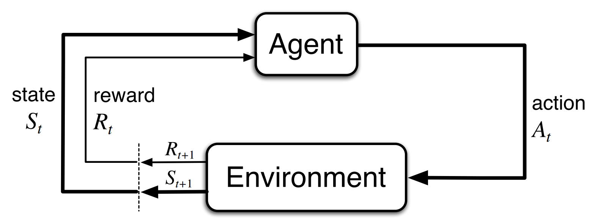
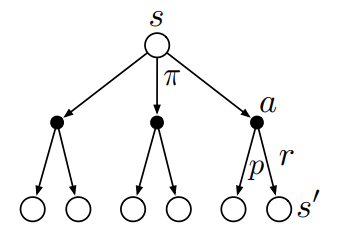
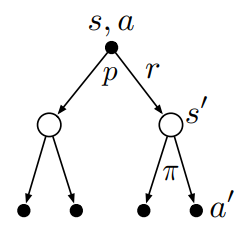
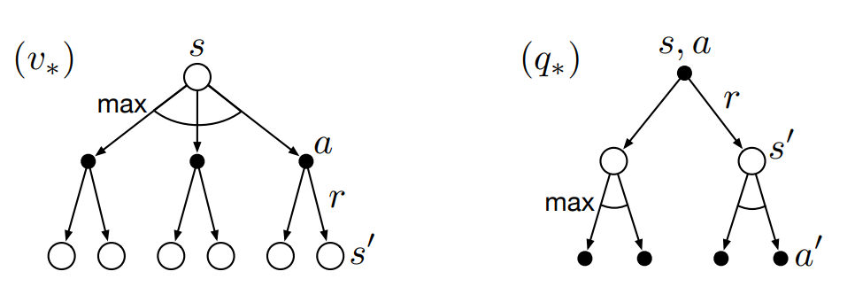
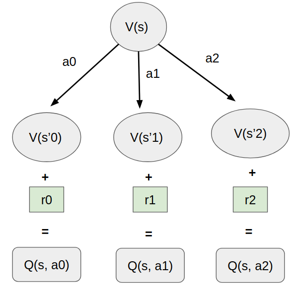
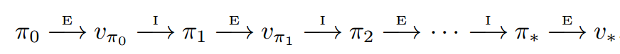
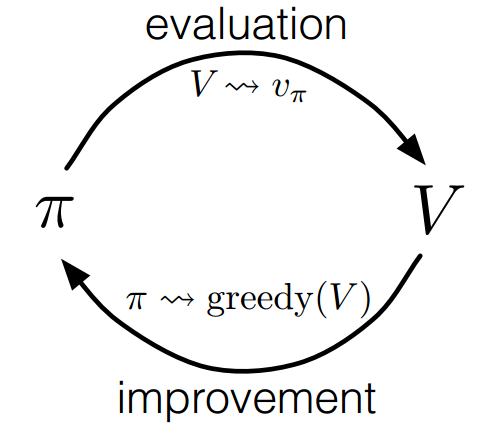
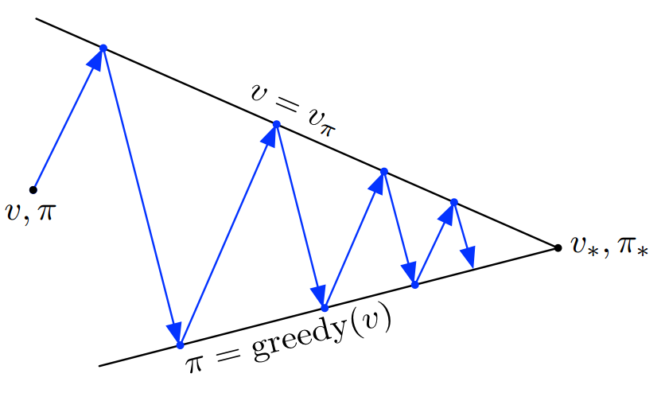

## Agent and Environment

<div align="center">
  
</div>

- For Agent:
  - Take action $a_t$ based on state $s_t$ and reward $r_t$
- For Environment:
  - Give reward $r_t$
  - Take the agent to next state $s_{t+1}$

### State, Action and Reward

- **State**: Agent's observation of itself and environment. e.g. An image of the environment, pose, velocity

  $s \in \mathcal{S}$, $\mathcal{S}$ is called **state space**.

- **Action**: Used to change the agent's state. e.g. turn left, right, stop for autonomous robots.

  $a \in \mathcal{A}$, $\mathcal{A}$ is called **action space**.

- **Reward**: A scalar feedback signal from the environment. Used to stimulate agents.

  $r \in \mathbb{R}, r\in \mathcal{R}$. $\mathcal{R}$ is called **reward space**.


### Trajectory and Transition model

A trajectory in a MDP is sequence of (states, actions and rewards), denoted as $\tau$
$$\tau = \{s_0, a_0, r_0, s_1, a_1, r_1, \cdots, s_T, a_T, r_T \}$$

What determine a trajectory?
- Initial state 
- Action from the agent
- A transition model which determines the reward and next state, given current state and action


## Markovian Decision Process (MDP)
	
### Markovian Property
	
Given all past states and current state, the probability distribution of future state depend on **only** on **current** state.

$$P(s_{t+1}|s_t, s_{t-1}, \cdots, s_0) = P(s_{t+1}|s_t)$$
	
Life lesson learned:
We should forget about the past and focus on the present. The future only depends on the present. 
    

### Trajectory and Transition model

**Transition model** (sometimes called dynamics model, world model) in MDP is a joint probability distribution of $s'$ and $r$, 
$$P(s', r | s, a) $$

Its summation over state and reward space is 1.
$$ \sum_{s \in \mathcal{S}} \sum_{r \in \mathcal{R}} P(s', r | s, a) = 1 $$

Sometimes we only care about the **state transition model**, then we can marginalize $P$ over $r$ and have

$$P(s'| s, a) = \sum_{r \in \mathcal{R}} P(s', r |s, a)$$
$$ \sum_{s \in \mathcal{S}} P(s'| s, a) = 1 $$

### Return
A **Return** is defined as the summation of rewards.
	
Infinite horizon return:
$$G_t = r_t + \gamma r_{t+1} + \gamma^2 r_{t+2} + \cdots = \sum_{k=0}^{\infty} \gamma^k r_{t+k}$$

Finite horizon return:
$$G_t = r_t + \gamma r_{t+1} + \gamma^2 r_{t+2} + \cdots + \gamma^{T-t} r_T = \sum_{k=0}^{T-t} \gamma^k r_{t+k}$$

Here $\gamma \in [0, 1] $ is defined as **discount factor**.

- $\gamma = 0$, agent focus on immediate rewards. 
- $\gamma = 1$, agent takes all future rewards equally.
- $\gamma \to 0$, agent becomes more myopic.
- $\gamma \to 1$, agent becomes more farsighted.

Some important properties of return:

Return has this recursive relationship:
$$
\begin{aligned}
    G_t &= r_t + \gamma r_{t+1} + \gamma^2 r_{t+2} + \cdots  \\
        &= r_t + \gamma (r_{t+1} + \gamma r_{t+2} + \cdots) \\
        &= r_t + \gamma G_{t+1}
\end{aligned}
$$

Return is bounded if $0 \leq \gamma < 1$, even for infinite returne:

$$
\begin{aligned}
    G_t &= r_t + \gamma r_{t+1} + \gamma^2 r_{t+2} + \cdots \\
        & \leq r_{max} (1 + \gamma + \gamma^2 + \cdots) \\
        & \leq r_{max} \frac{1}{1-\gamma}
\end{aligned}
$$

## Policy and Value function

### Value function

**State value** function
$$V_{\pi}(s) = \mathbb{E} [G_t | s_t = s ] $$

Meaning: at state $s$, follow policy $\pi$, what is the **expected return** the agent can get?

**Action value** function (Q value):
$$Q_{\pi}(s, a) = \mathbb{E} [G_t | s_t = s, a_t = a ] $$

Meaning: at state $s$, **first** take action $a$, **then** follow policy $\pi$, what is the **expected return** the agent can get?

IMPORTANT questions: Why expectation? Where does the stochasticity come from?

Stochasticity:
- Policy $\pi(a|s)$ could be stochastic
- Transition function $p(s', r | s, a)$ could be stochastic

Can you think about he benefit about policy being stochastic? 

Recursive relationship for value function:
$$
\begin{aligned}
    V_{\pi}(s) &= \mathbb{E} [G_t | s_t = s] \\
    &= \mathbb{E} [r_{t} + \gamma G_{t+1} | s_t = s] \\
    &= \mathbb{E} [r_{t}] +  \mathbb{E}[\gamma G_{t+1} | s_t = s] \\
    &= \mathbb{E} [r_{t}] +  \mathbb{E}[ \mathbb{E}[\gamma G_{t+1} | s_t = s]] \\
    &= \mathbb{E} [r_{t} + \gamma \mathbb{E}[G_{t+1} | s_t = s]] \\
    &= \sum_{a \in \mathcal{A}} \pi(a|s) \sum_{s' \in \mathcal{S}} \sum_{r \in \mathcal{R}} p(s', r | s, a) \left[r + \gamma \mathbb{E} [G_{t+1} | s_{t+1} = s'] \right]\\
    &= \sum_{a \in \mathcal{A}} \pi(a|s) \sum_{s' \in \mathcal{S}} \sum_{r \in \mathcal{R}} p(s', r | s, a) \left[r + \gamma V_{\pi}(s') \right]\\
\end{aligned}
$$

This is called the **Bellman equation** for $V_{\pi}(s)$.


Backup table for value function:

<div align="center">
  
</div>


Each branch of this tree diagram is :

- the possible next action (shown in black nodes), determined by policy
- the possible state (shown in white nodes), determined by state transitions.

Recursive relationship for action value function:
$$
\begin{aligned}
    Q_{\pi}(s, a) &= \mathbb{E} [G_t | s_t = s, a_t = a] \\
    &= \mathbb{E} [r_{t} + \gamma G_{t+1} | s_t = s] \\
    &= \sum_{s' \in \mathcal{S}} \sum_{r \in \mathcal{R}} p(s', r | s, a) \left[r + \gamma V_{\pi}(s') \right]
\end{aligned}
$$

Backup table for action value function:

<div align="center">
  
</div>

What is the relationship between $V_{\pi}(s)$ and $Q_{\pi}(s, a)$ ?

Look again at the backup tables. What did you find?
- Backup tables show $Q(s,a)$ goes one step further than $V(s)$ !
- We need to get the expectation of $Q(s,a)$ over policy $\pi$ to get $V(s)$

The relationship between state and action value function:
$$V_{\pi}(s) = \mathbb{E} \left[Q(s, a)\right] = \sum_a \pi(a|s) Q_{\pi}(s, a)$$


Then the equation for $Q(s, a)$ becomes,

$$
\begin{aligned}
Q_{\pi}(s, a) &= \mathbb{E} [G_t | s_t = s, a_t = a] \\
&= \mathbb{E} [r_{t} + \gamma G_{t+1} | s_t = s] \\
&= \sum_{s' \in \mathcal{S}} \sum_{r \in \mathcal{R}} p(s', r | s, a) \left[r + \gamma V_{\pi}(s') \right] \\
&= \sum_{s' \in \mathcal{S}} \sum_{r \in \mathcal{R}} p(s', r | s, a) \left[r + \gamma \sum_{a'} \pi(a'|s') Q_{\pi}(s', a') \right]
\end{aligned}
$$

This is the **Bellman equation** for $Q_{\pi}(s, a)$.

## Policy
A **policy** $\pi(a|s)$ is the mapping from state to action. 

One way to derive policy is to choose the action corresponding to the largest action value function $Q(s, a)$:

$$\pi(a|s) = \argmax_{a} \left[ Q(s, a) \right]$$

## Optimality in Value Function and Policy
    
What is optimal value function and policy?
- Optimal value function: The true value function based optimal policy.
- Optimal policy: Policy which maximize value functions. 

Optimal state value function $V_{\pi}(s)$
$$ V_{*}(s) = \max_{\pi} V_{\pi}(s) $$

Optimal action value function $Q_{\pi}(s, a)$
$$
\begin{aligned}
    Q_{*}(s, a) &= \max_{\pi} [Q_{\pi}(s, a)] \\
    &= \mathbb{E} \left[ r_t + \gamma V_{*}(s_{t+1}) | s_t = s, a_t = a\right]
\end{aligned}
$$

Bellman optimality equations:
for state value function $V_{\pi}(s)$
$$
\begin{aligned}
    V_*(s) &= \max_{a} Q_{\pi_x} (s, a) \\
    &= \max_a \sum_{s' \in \mathcal{S}} \sum_{r \in \mathcal{R}} p(s', r | s, a) \left[r + \gamma V_*(s') \right] 
\end{aligned}
$$
    
for action value function $Q_{\pi}(s)$,
$$
\begin{aligned}
    Q_*(s, a) 
    &= \sum_{s' \in \mathcal{S}} \sum_{r \in \mathcal{R}} p(s', r | s, a) \left[r + \gamma \max_{a'} Q_*(s', a') \right] 
\end{aligned}
$$
    
The backup diagram for optimal value functions:
    
<div align="center">
  
</div>

What differences did you noticed between previous backup tables? We do not do expectation anymore, but maximization.

# Solve MDP
## Solve Value function as Linear System

Rewrite Bellman equation with two simplification:

- Marginalize transition over reward: $P(s'| s, a) = \sum_{r \in \mathcal{R}} P(s', r |s, a)$
- Assume deterministic policy

Then it becomes
$$
    V_{\pi}(s) = \sum_{s' \in \mathcal{S}} p(s'| s, a) \left[r + \gamma V_{\pi}(s') \right]
$$

with all the states $s \in \mathcal{S}$ enumerated, $|\mathcal{S}| = N + 1$
$$
\begin{aligned}
\begin{bmatrix}
V(s_0) \\
V(s_1) \\
\vdots \\
V(s_N)
\end{bmatrix}
&=
\begin{bmatrix}
r(s_0) \\
r(s_1) \\
\vdots \\
r(s_N)
\end{bmatrix}
+ \gamma
\begin{bmatrix}
p_{00} & p_{01} & \cdots & p_{0N} \\
p_{10} & p_{11} & \cdots & p_{1N} \\
\vdots & \vdots & \ddots & \vdots \\
p_{N0} & p_{N1} & \cdots & p_{NN}
\end{bmatrix}
\begin{bmatrix}
V(s_0) \\
V(s_1) \\
\vdots \\
V(s_N)
\end{bmatrix}
\end{aligned}
$$

Then it becomes
$$
\mathbf{v} = \mathbf{r} + \gamma \mathbf{P} \mathbf{v}
$$
$$
(\mathbf{I} - \gamma \mathbf{P}) \mathbf{v} = \mathbf{r} 
$$
$$
\mathbf{v} = (\mathbf{I} - \gamma \mathbf{P}) ^{-1}\mathbf{r} 
$$

Issues of this approach:
- Time consuming for solving $\mathbf{v}$, matrix inversion is expensive!
- Not suitable for large MDP

What are alternative solutions? Iterative methods!

## Dynamic Programming (DP)

**Dynamic Programming** is a Iterative solutions to solve MDP.

Recall Bellman optimality equations: 
- We get get optimal policy $\pi_*(a|s)$ with optimal action value function $Q_*(s, a)$
- We get also get optimal policy $\pi_*(a|s)$ with optimal state value function $V_*(s).$

- Recall: $Q_{*}(s, a) = \mathbb{E} \left[ r_t + \gamma V_{*}(s_{t+1}) | s_t = s, a_t = a\right]$
- This is called **one-step look-ahead**

Dynamic Programming (DP):
- Iterative solution to solve optimal value function and optimal policy
- Finite state, action, reward space
- Transition model $p(s, r'|s, a)$ is given


## Policy Evaluation

How can we know the value function $V_{\pi}(s)$ with of a policy $\pi(a|s)$ with given MDP?
- One solution is called **policy evaluation**.
- Compute the value function given policy is called **prediction} in RL context.

How can we iteratively compute the value function given policy?

Recall Bellman equation for state value function:

$$
\begin{aligned}
V_{\pi}(s) = \sum_{a \in \mathcal{A}} \pi(a|s) \sum_{s' \in \mathcal{S}} \sum_{r \in \mathcal{R}} p(s', r | s, a) \left[r + \gamma V_{\pi}(s') \right]\\
\end{aligned}
$$

We'd like to convert it to an iterative version (assume the iterative variable being $i$)

$$
\begin{aligned}
V_{i+1}(s) = \sum_{a \in \mathcal{A}} \pi(a|s) \sum_{s' \in \mathcal{S}} \sum_{r \in \mathcal{R}} p(s', r | s, a) \left[r + \gamma V_{i}(s') \right]\\
\end{aligned}
$$

**Policy Evaluation** algorithm:

```python
def policy_evaluation(self, value_func, policy):
    n_iter = 0
    for n_iter in range(1, self.max_iterations+1):
        # for each state
        Delta = 0
        for s in range(self.nS):
            pre_v_s = value_func[s]
            V_s = 0
            # for each action in current state
            for a in range(self.nA):
                # get the probability of taking action a at current state s
                P_a = policy[s, a]
                # for each possible NEXT state taking action a at current state s
                for P_trans, s_next, reward, is_done in self.env.P[s][a]:
                    V_s += P_a * P_trans * (reward + self.gamma * value_func[s_next])

            value_func[s] = V_s
            # see if the value function converge
            Delta = max(Delta, abs(pre_v_s - value_func[s]))

        if Delta < self.theta:
            break

    return value_func, n_iter
```

## Policy Improvement
Policy evaluation compute value function for a known policy. Is that policy the final policy we want?
- No! We want optimal policy. Not an arbitrary one. 
- Thus we need to improve this "arbitrary policy".

**Policy Improvement** key ideas:
- Compute the $Q(s, a)$ given $V(s)$
- Greedily find the action $a_*$ with max Q value.
- Compare the action $a_*$  with old action from policy $\pi(a|s)$

One-step look ahead to compute action value function:
$$Q(s, a) = \mathbb{E} \left[ r_t + \gamma V(s_{t+1}) | s_t = s, a_t = a\right]$$

Illustration of one-step look-ahead:

<div align="center">
  
</div>

{Policy Improvement}
Select greedy action to update old policy, if necessary,
$$
\begin{aligned}
\pi'(s) &= \argmax_a Q(s, a) \\
&= \argmax_a \mathbb{E} \left[ r_t + \gamma V(s_{t+1}) | s_t = s, a_t = a\right]
\end{aligned}
$$

When is it necessary?
- $V_{\pi'}(s) \geq V_{\pi}(s)$
- Equivalent to $Q_{\pi'}(s, \pi'(s)) \geq V_{\pi}(s)$

This is called **policy improvement theorem**.

The algorithm of policy improvement is:
```python
def policy_improvement(self, value_func, policy):
    policy_stable = True
    policy_new = policy
    for s in range(self.nS):
        # action from the policy before policy improvement
        old_a = np.argmax(policy[s])
        # compute action-value function q(s,a) by one step of lookahead
        q_s = self.compute_q_value_cur_state(s, value_func)
        # choose the best action and greedily improve the policy
        best_a = np.argmax(q_s)
        policy_new[s, :] = self.action_to_onehot(best_a)

        if old_a != best_a:
            policy_stable = False

    return policy_stable, policy_new
```

## Policy Iteration
We can iteratively evaluation policy, and then improve policy

<div align="center">
  
</div>

This gives us the algorithm of **policy iteration**
```python
def policy_iteration(self):
    policy = np.zeros([self.nS, self.nA])
    value_func = np.zeros(self.nS)

    # iteratively evaluate the policy and improve the policy
    total_num_policy_eval = 0
    for num_policy_iter in range(1, self.max_iterations+1):
        # evaluate policy and improve policy
        value_func, num_policy_eval = self.policy_evaluation(value_func, policy)
        policy_stable, policy = self.policy_improvement(value_func, policy)

        total_num_policy_eval += num_policy_eval
        if policy_stable:
            print("num of policy iteration:%d and policy evaluation: %d" %(num_policy_iter, total_num_policy_eval))
            return value_func, policy
```

## Value Iteration

In policy evaluation, we don't have to wait until the convergence of value function $V_{\pi}(s)$ given policy $\pi$.

Take a short-cut by just doing one step of policy evaluation:
$$Q_i(s, a) = \mathbb{E} \left[ r_t + \gamma V_i(s_{t+1}) | s_t = s, a_t = a\right] $$
$$V_{i+1}(s) = \max_a Q_i(s, a)$$

What about policy improvement?
- The policy is improved subtlety. When value function takes the $\max$ of $Q_i(s, a)$, the policy is already improved greedily.
- Recall the equivalence of $\pi_*(a|s)$ and $V_*(s)$

This method is called **value iteration**,
```python
def value_iteration(self):
    # initialize the value function
    value_func = np.zeros(self.nS)
    for n_iter in range(1, self.max_iterations+1):
        Delta = 0
        for s in range(self.nS):
            pre_v_s = value_func[s]
            # we have to compute q[s] in each iteration from scratch
            # and compare it with the q value in previous iteration
            q_s = self.compute_q_value_cur_state(s, value_func)

            # choose the optimal action and optimal value function in current state
            value_func[s] = max(q_s)
            Delta = max(Delta, np.abs(value_func[s] - pre_v_s))

        if Delta < self.theta:
            break
    
    print("num of iteration is: %d" %n_iter)
    V_optimal = value_func

    # output the deterministic policy with optimal value function
    policy_optimal = np.zeros([self.nS, self.nA])
    for s in range(self.nS):
        q_s = self.compute_q_value_cur_state(s, V_optimal)
        # choose optimal action
        a_optimal = np.argmax(q_s)
        policy_optimal[s, a_optimal] = 1.0

    return V_optimal, policy_optimal
```


**Generalized Policy Iteration**

The process of generalized Policy Iteration (policy iteration and value iteration)

<div align="center">
  
</div>

Convergence to optimal policy and value function:

<div align="center">
  
</div>
